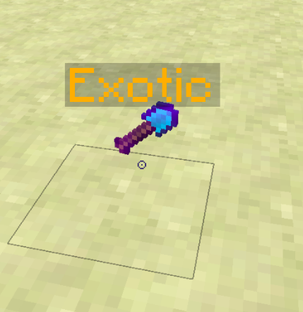

<h3 style="color: blue"> A simple plugin, for pocketmine 4.0</h3>

### Description

allows when the item is thrown to display the number of items as well as its name. we can configure the display with a configuration

 

[Join Discord Team, click here](https://discord.gg/hjbADqXRde)
  

